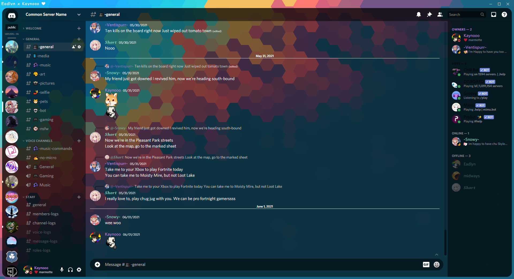
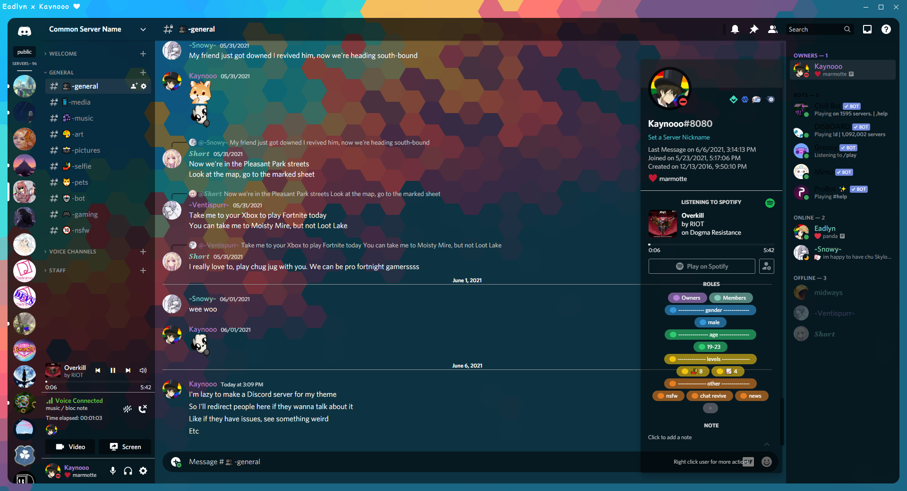
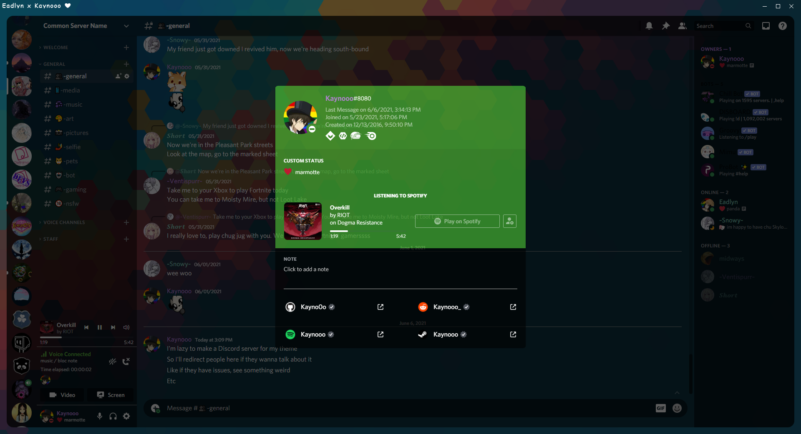
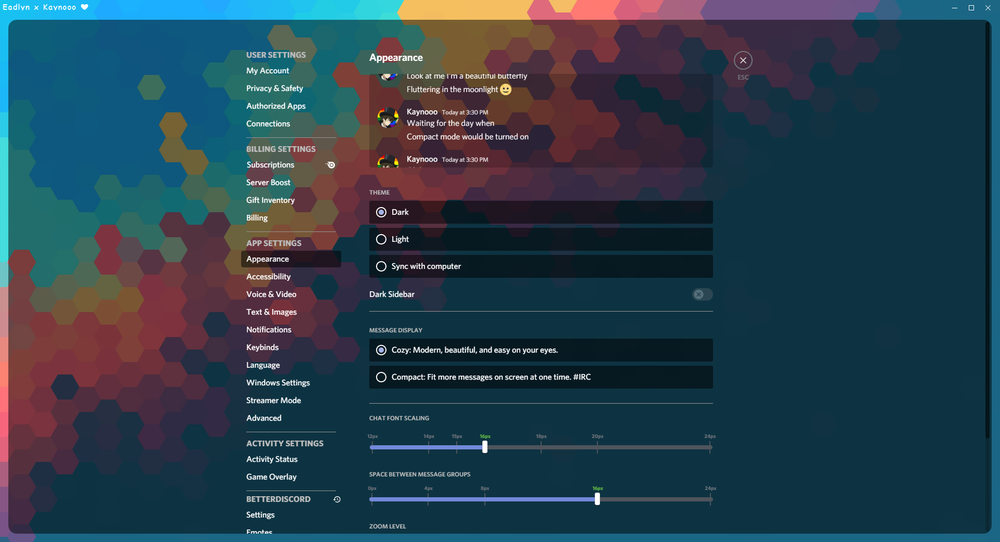
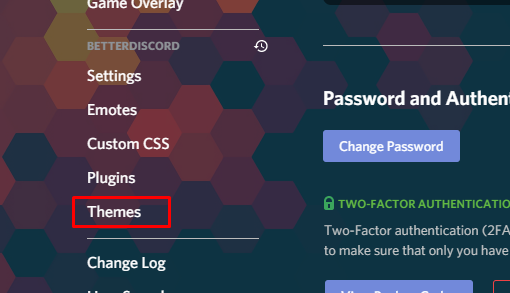
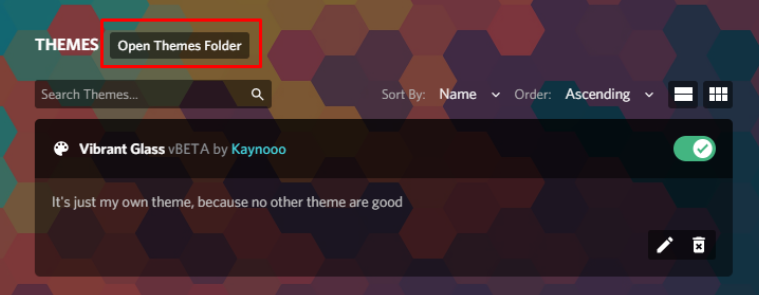
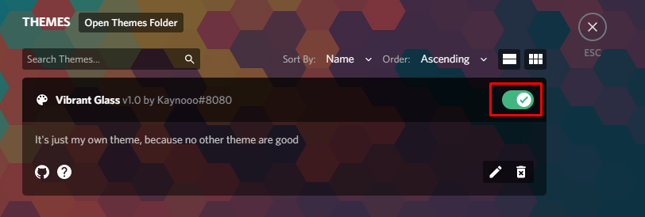

# **Vibrant Glass Theme**

I made this theme only for myself, but some friends found it cool, so I decided to share it here.

It doesn't take more performance than BetterDiscord/Discord already does.

It's just a really simple theme that I made in a few hours.

## **Issues**

If you see anything weird or anything that can be improved, please tell me on my [Discord server](https://discord.gg/XhPKd5x7Fz).

## **Preview**

## **Tutorial**

Download the [glass_local.theme.css](https://raw.githubusercontent.com/Kayno0o/vibrant-glass-theme/main/glass_remote.theme.css) file

Go to your [BetterDiscord](https://betterdiscord.app/) settings (in Discord) -> themes : 

open themes folder : 

move the theme into your theme folder

Activate it : 

And enjoy !

## **Customization** 

to customize rgb color : https://www.google.com/search?q=color+picker and copy the RGB thing

to create custom gradient : https://cssgradient.io/ and copy the linear-gradient

## **Performances Stats** (aka useless stats because I don't think you need it)

I have like 17 plugins ON so that doesn't help with performances but here's what I got (with and without the theme)

**CPU**:

when scrolling in a text channel
- 5-6% without
- 7-8% with my theme (+2%)

idling
- 1-2% without
- 1-2% with theme

**RAM**:

+50 to +100MB more RAM used with the theme
